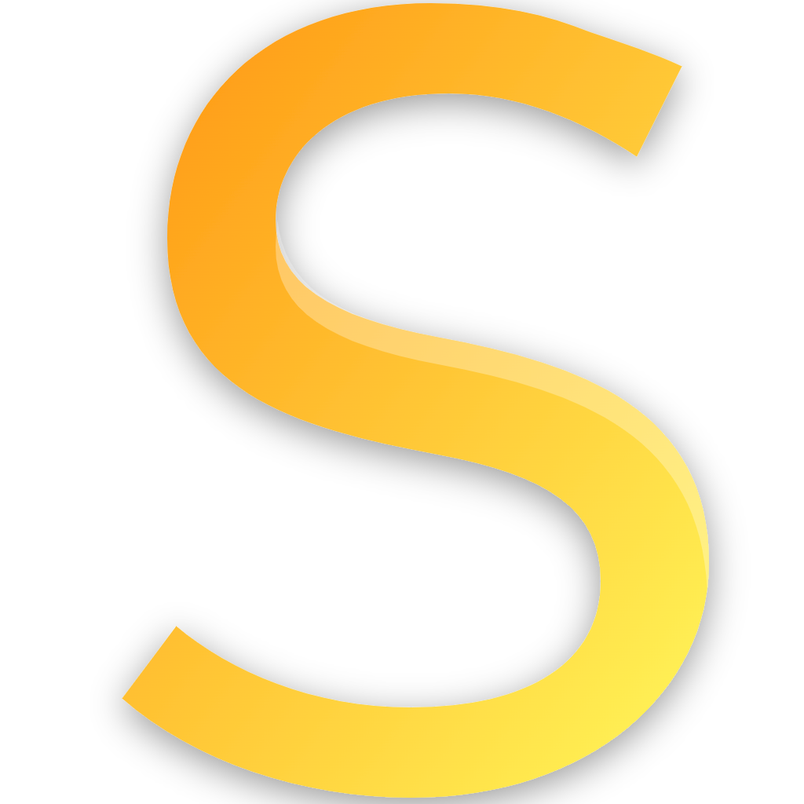

# 🌋 Stable Studio

<div align="center">

  

  <h3>The Lightning-Fast, Local Stable Diffusion Experience</h3>
  <p><i>Powered by Vulkan, Neutralinojs & Web Technologies.</i></p>

  <!-- Badges -->
  <p>
    <a href="https://github.com/Md-Siam-Mia-Man/Stable-Studio/releases">
      
    </a>
    <a href="https://github.com/Md-Siam-Mia-Man/Stable-Studio/releases">
      
    </a>
    
    
  </p>

  <!-- Tech Stack Badges -->
  <p>
    
    
    
  </p>

</div>

---

## 📖 About

**Stable Studio** is a standalone, lightweight GUI for running Stable Diffusion locally on your GPU. Unlike other implementations that require heavy Python environments (Conda/venv) or specific CUDA hardware, Stable Studio utilizes the **Vulkan** backend.

This means it runs natively on virtually **any modern GPU** (AMD, NVIDIA, Intel Arc) out of the box.

---

## ✨ Key Features

### 🎨 **Premium UI/UX**

* **Gold & Black Aesthetics:** A meticulously crafted interface with **Light** (default) and **Dark** modes.
* **Infinite Canvas:** Pan (Right-Click) and Zoom (Scroll) to inspect every pixel of your generation.
* **Floating HUD:** Quick controls to reset view, save, or delete images instantly.

### ⚡ **High Performance**

* **Vulkan Powered:** Runs on AMD Radeon, NVIDIA GeForce, and Intel Arc GPUs.
* **Live Previews:** Watch the diffusion process step-by-step in real-time.
* **Low Memory Footprint:** Built on Neutralinojs, consuming significantly less RAM than Electron-based apps.

### 🛠️ **Professional Control**

* **Advanced Parameters:** Full control over Steps, CFG Scale, Seed, and Dimensions.
* **Sampler Selection:** Choose from Euler A, Euler, DPM++ (2S/2M), Heun, and LCM.
* **Scheduler Control:** Discrete, Karras, and Exponential schedulers.
* **Custom Models:** Support for `.safetensors`, `.gguf`, and `.bin` checkpoints.

---

## 📥 Installation

### **Option 1: Windows Installer (Recommended)**

1. Go to the [**Releases**](https://github.com/Md-Siam-Mia-Man/Stable-Studio/releases) page.
2. Download `Stable_Studio_Setup.exe`.
3. Run the installer and launch the app.

### **Option 2: Portable (Source)**

1. Download `Stable-Studio.rar` from Releases.
2. Extract the archive.
3. Run `bin/neutralino-win_x64.exe`.

> **Note:** On first launch, the `models/` folder will be empty. You must download a Stable Diffusion checkpoint (e.g., from Civitai or HuggingFace) and place the `.safetensors` file into the `models` folder.

---

## 💻 Development Setup

Want to contribute or build it yourself?

### **Prerequisites**

* [Node.js](https://nodejs.org/) (v18+)
* [Neutralinojs CLI](https://neutralino.js.org/) (`npm install -g @neutralinojs/neu`)
* [NSIS](https://nsis.sourceforge.io/) (Required for building the installer)

### **1. Initialization**

Clone the repo and run the magic init script. This installs dependencies and sets up the folder structure.

```powershell
git clone https://github.com/Md-Siam-Mia-Man/Stable-Studio.git
cd Stable-Studio
npm install
npm run init
```

### **2. Running (Dev Mode)**

Starts the app with Hot-Reload and DevTools enabled.

```powershell
npm start
```

### **3. Building (Production)**

Compiles CSS, bundles the binary, and creates the Windows Installer.

```powershell
npm run build
```

*Output will be in the `release/` folder.*

---

## 📂 Project Structure

```plaintext
/Stable Studio
├── 📁 backend/          # ⚙️ Vulkan binaries (sd.exe & dlls)
├── 📁 models/           # 📦 Checkpoints (User provided)
├── 📁 outputs/          # 🖼️ Generated images
├── 📁 release/          # 📦 Final built installers
├── 📁 resources/        # 🎨 Frontend Source
│   ├── 📁 assets/       #    ├── Icons & Fonts (Poppins)
│   ├── 📁 css/          #    ├── Compiled Styles
│   ├── 📁 js/           #    ├── App Logic (main.js)
│   └── index.html       #    └── Entry Point
├── 📁 src/              # 📝 Tailwind Input CSS
└── 📁 helpers/          # 🛠️ Build & Init Scripts
```

---

## 🤝 Credits

* **Author:** [Md Siam Mia](https://github.com/Md-Siam-Mia-Man)
* **Backend:** [Stable-Diffusion.cpp](https://github.com/leejet/stable-diffusion.cpp)
* **Frontend Framework:** [Neutralinojs](https://neutralino.js.org/)

---

## 📄 License

This project is licensed under the **MIT License**.

Copyright (c) 2025 **Md Siam Mia**.
